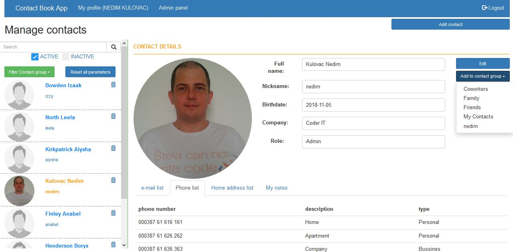

# ContactBook

ContactBook is Java Web Application. It allows to login/register users, edit profile (upload image, enter/edit personal information, edit/enter lists of emails, phone number, addresses, notes), search for contacts, create contact groups.
(Work in progress.)

---

### Clone

- Clone this repo to your local machine using `https://github.com/KulovacNedim/ContactBook.git`

---

### database 

- Import database script from db-script folder. Don't forget to enter credentials for your database (src/main/java/dbConnectionMenager/ConnectionMenager.java)

---

